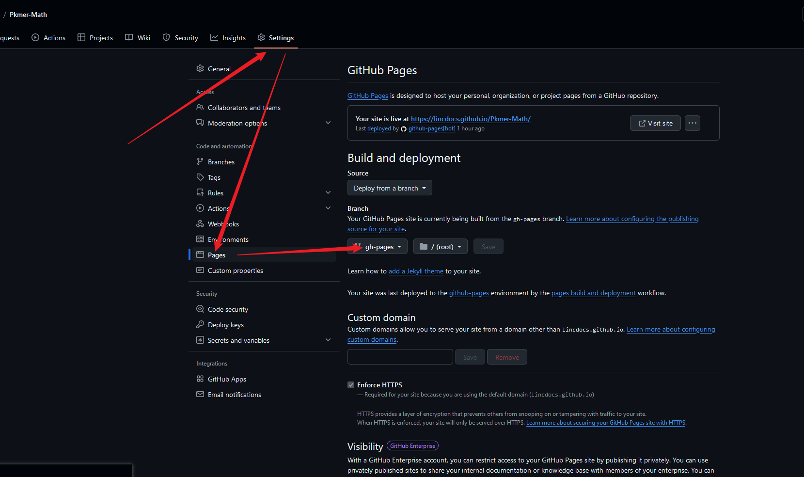

# 生成文档网站 (零配置极简版)

核心: 使用 [LincZero.github.io](https://github.com/LincZero/LincZero.github.io) 仓库 (扩展于 [VuePress Theme Hope](https://theme-hope.vuejs.press/)) 的单工具流文件构建系统

## 构建方法

两步完成你的文档网站

1. 复制 .github 文件到你的项目根目录上 (主要使用 `.github/workflows/static.yml`)。此时commit后就会自动构建啦，可能需要稍等一段时间 (在顶部栏中的actions可以看到进度)，等待构建完成后进行下一步。
2. github的项目页中，以此选择：setting > page > 将 `Source` 设为 `Deploy from a branch`，将 `Branch` 设置为 `gh-pages`，如下图所示。当启用page后，你就可以通过该图中上面给出的链接来访问你的网站了！
  
  

## 功能

对比其他文档部署框架有什么优点？为什么选用 LincDocs Workflow？

- 更适配obsidian:
  对部分obsidian特性与插件进行支持。如anyblock、callout语法、wiki双链、关系图谱等
- 操作简单，无需配置，开箱即用:
  两步完成，工作流会自动根据仓库添加需要的配置
- 零添加，无配置，无污染:
  构建库与文档库分离,单工作流文件部署。不需要添加配置文件以及对文档仓库进行污染。
- 迁移支持优化:
  支持从obsidian中迁移、支持识别mdBook的 `SUMMARY.md` 文件作为目录。只要你拥有一个markdown笔记库，就能轻松构建自己的在线文档!
- 强大搜索:
  像 mdBook 就只能搜索英文
- 插件丰富:
  除前面说到的部分obsidian扩展外，还支持 mermaid、plantuml、markdown-it-container 等
- 支持扩展、自定义
  想要更多的功能，可以创建github，可以fork编译系统并自行修改

## 构建方法 - 可选

### 可选：代理库

可选方案：以上方案实现了构建库与笔记库分离，但依然需要往笔记库添加工作流文件。

如果你无法修改笔记库文件，你可以使用另一个方案：建立一个代理仓库。

该仓库中除了需要添加前面说的工作流文件外，还需要往添加一个 `agency` 文件，并将其第一行修改成对应笔记库的克隆地址 (格式为 `https://... .git`)。

这样也可以将目标文档库编译成静态文档网站。

### 可选：项目与文档混合的文档库

可选方案：如果你的笔记库不是纯粹的笔记，而是 "项目+文档" 的形式。

也可以，你的文档部分需要在 `docs` 文件夹里，其他项目部分在不要放这个文件夹里，就可以了。

### 前面两个可选方案的原理

- 如果文档中有 `agency` 文件：会选择 `agency` 文件的第一行为仓库地址 (格式为 `https://... .git`)，否则选择当前仓库为文档库。所以你除了可以在原仓库的基础上新增工作流，也可以创建一个代理仓库用于生成文档而不必修改原仓库。
- 如果文档中有 `docs` 文件夹：会选择 `docs` 文件夹为文档库，否则选择整个仓库内容为文档库。所以你的仓库是纯粹的文档库或是带有文档的项目，都可以用。

## FAQ (常见问题)

如果有问题在这里或在issue中进行搜索，如果无法解决，可以创建一个issue提问

- 报错：
  ```bash
  /usr/bin/git worktree remove github-pages-deploy-action-temp-deployment-folder --force
  Error: The deploy step encountered an error: The process '/usr/bin/git' failed with exit code 128 ❌
  Notice: Deployment failed! ❌
  ```
  这可能是因为Action没有开启可写权限 (一般不需要，好像个别情况才要)。在 项目仓库页 > 工具栏的设置 > Action > 拉到下面，有一个选项是让你的工作流可写
  （如果在Github组织中，需要在组织设置中而非项目仓库页的设置中，进行设置）
- 为什么我在第二步中没看到 `gh-pages` 分支？
  需要等待构建完成（在顶部栏中的actions可以看到进度，绿色为构建成功，黄色正在构建，红色为构建失败）
- 为什么我在setting中没有看到 page 选项？
  page选项需要是 yourUserName.github.io 的仓库地址或者 organization 内的项目，才有page选项。如果没有，要么将你的仓库位置修改成这些允许有page的位置，要么使用另一套方案（详情搜issue：分离文档仓库与构建系统仓库）
- 报错说分支不对/你的主分支不是main？
  修改yml文件，将里面的分支 `main` 修改为你现在的分支名即可
- 什么时候会自动更新内容？
  正常commit后，会自动进行文档构建，构建结束后就会自动更新网站内容
- 如何使用非github.io部署？
  略，提issue，有人问我再回
- 我没有在这里找到我的问题？
  在issue中搜索看是否有人问过相同的问题，看是否能解决。若没有，则提issue
- 还有其他好用的单工作流部署系统吗？
  github默认的jekyll、python的mkdocs-material、mdBook、cookbook 等
